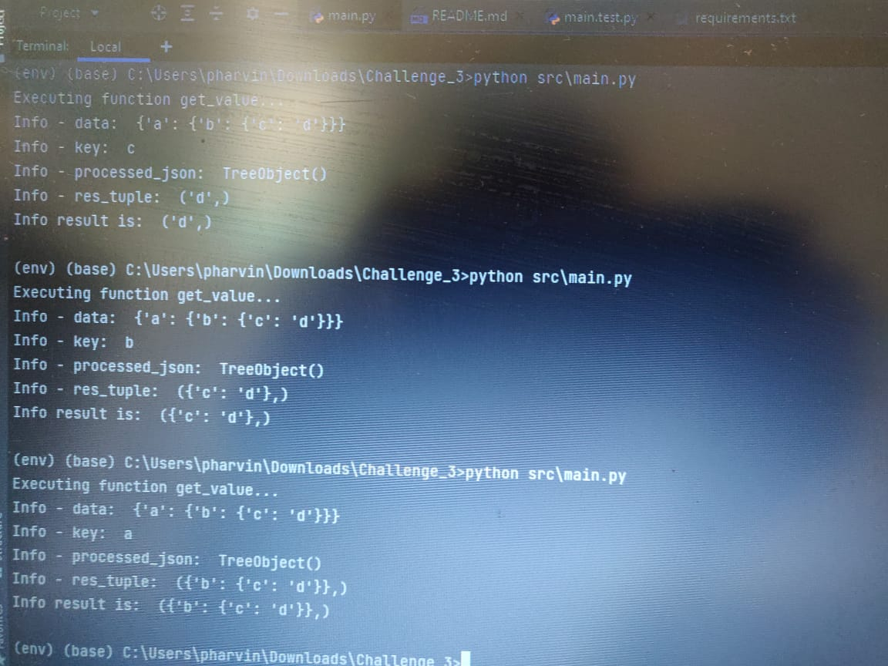

# This is developed using python lanaguage.  

## How to run program  
1. Create python virtual env "py -m env env".  
2. Activate python venv ".\env\Scripts\activate".  
3. Deactivate python venv ".\env\Scripts\deactivate".  
4. Install required python package "pip install -r requirements.txt".  
5. Run the script "python main.py".  
6. Output is:  
   
